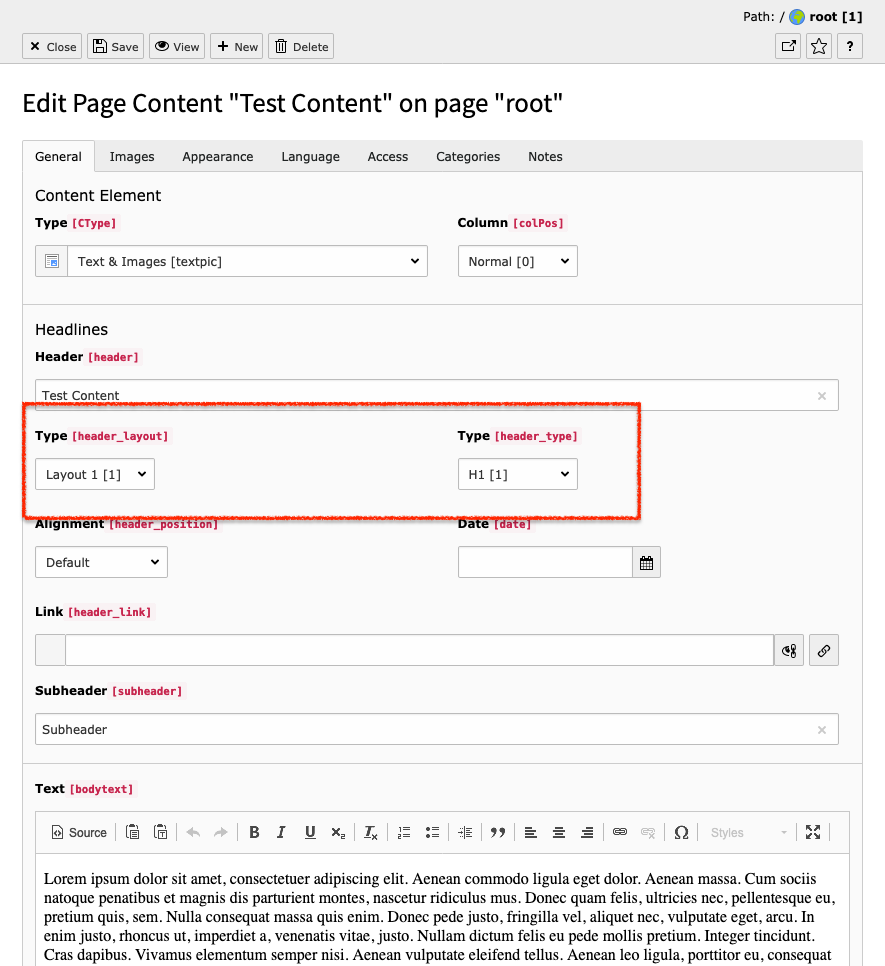
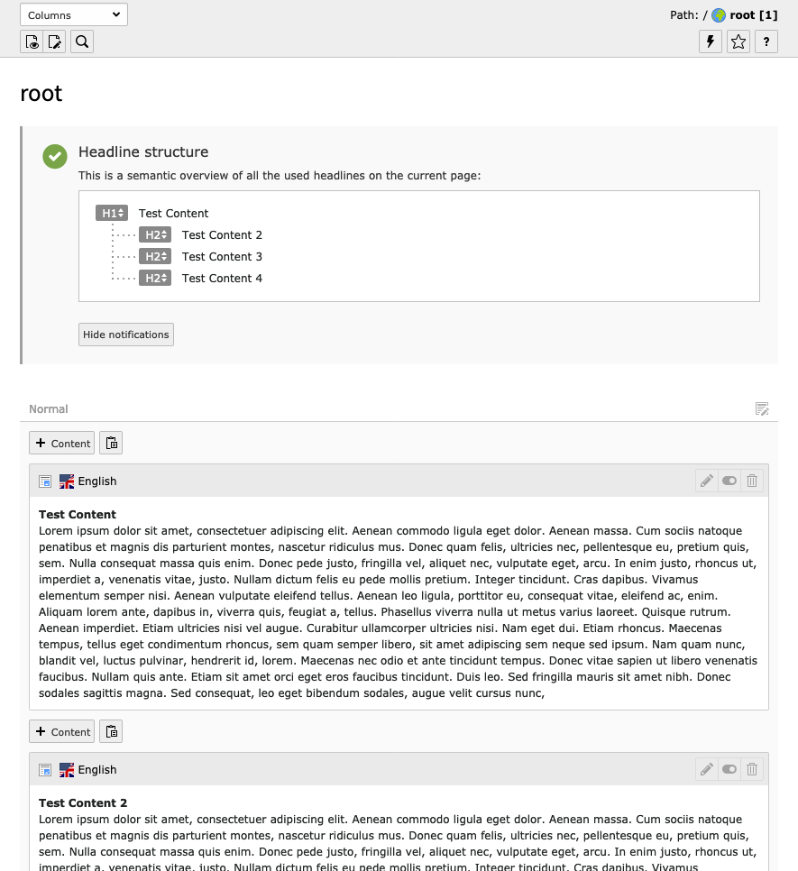
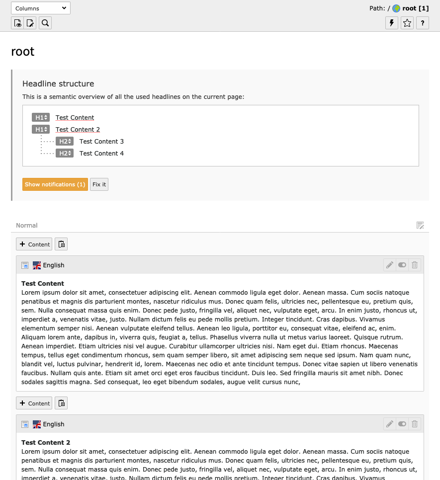
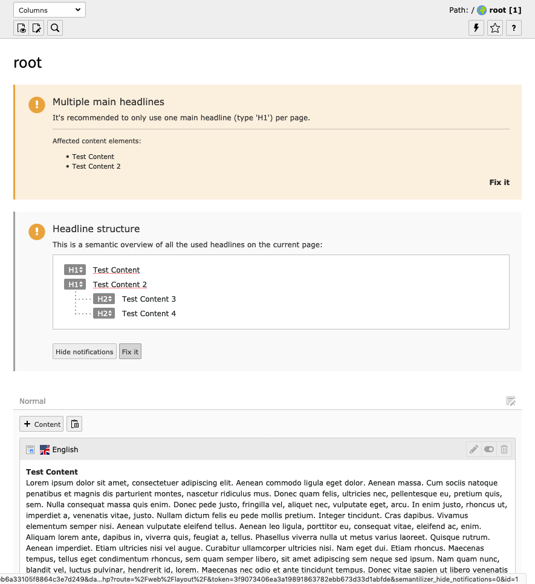
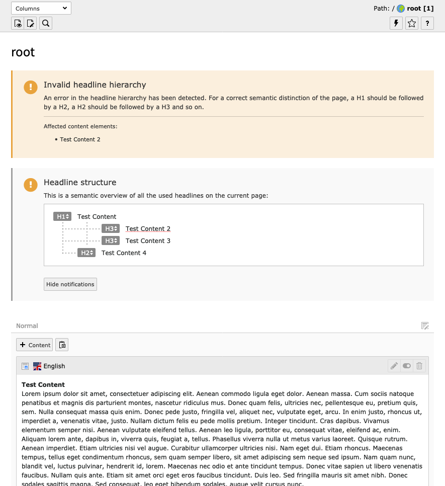

# The Semantilizer

## :question: What is it?

The Semantilizer is a TYPO3 extension, that adds more functionality to the TYPO3 own headlines of content elements. This extension will detach the semantic definition from the field `header_layout` for the headlines of the content elements. It also adds an overview over all currently used headlines in content elements across the current page. This will display also potential errors in the structuring of headlines and gives easy fixing options. Installed in TYPO3 10, the semantilizer also offers a widget for your dashboard.

## :wrench: Installation

* Get the extension via composer: `composer require zeroseven/z7-semantilizer`
* Make sure the typoscript setup gets included **after** the configuration of fluid_styled_content to override their partials for the headlines
* Make sure you enable the extension in the backend
* That's it!

## :roller_coaster: How to use

You will find an understandable info box at the top of each page overview in the page module. This info box helps you figure out the current headline structure of the page and make necessary fixes right away.

For content elements you will find the before mentioned detachment of semantic meaning from the headlines.



<br />
<br />
<br />

---

**If you have everything configured correctly and notifications enabled, your content will look like this:**



<br />
<br />
<br />

---

**If there are errors in your site configurations it is helpful, to turn on notifications:**



<br />
<br />
<br />

---

**The extension then show's you what's wrong with the current configuration and offers easy "Fix it"-Buttons that will fix your configuration and directly edit the ``header_type``.**





## :point_right: Tips

If you want to make the labels of `header_layouts` more understandable, overwrite them like so:

```tsconfig
TCEFORM.tt_content {
    header_layout {
      removeItems = 2
      altLabels.. = Medium
      altLabels.1 = Larger
      altLabels.3 = Smaller
      addItems.fancy_pink_sparkling_turned_around_bouncing_header = The nice one!
    }
}
```

## :gear: Options

You can disable the preview of the headlines on some pages. To achieve this, add this to your PageTSConfig:

```
tx_semantilizer.disableOnPages = 42,84
```

You can also disable the headline checking for specific content elements, like so:

```
tx_semantilizer.ignoreCTypes = div, html
```

### colPos ordering for backend layouts

(since v2.1.0)

Per default only content elements with colPos = 0 are shown. You can configure the colPos ordering for each backend layout. The backend layout identifier is the array key here. _Items with a colPos which is not defined there won't be listed._

```
tx_semantilizer.colPosOrdering {
  simple = 8,0,9
  2_columns = 8,0,2,9
}
```

### Fixed page title

If the page headline is set via page properties, you can implement your own functions to adapt to this in the semantilizer. Register one or more classes implements the `FixedTitleInterface` like the following example:

**ext_localconf.php**
```php
$GLOBALS['TYPO3_CONF_VARS']['EXT']['z7_semantilizer']['fixedPageTitle'][0] = \Vendor\Extension\Hooks\RootPageTitleHook::class;
$GLOBALS['TYPO3_CONF_VARS']['EXT']['z7_semantilizer']['fixedPageTitle'][1] = \Zeroseven\Semantilizer\FixedTitle\PageTitle::class;
```

**PageTitleHook.php**
```php
<?php

namespace Vendor\Extension\Hooks;

use Zeroseven\Semantilizer\FixedTitle\FixedTitleInterface;
use Zeroseven\Semantilizer\Models\ContentCollection;

class RootPageTitleHook implements FixedTitleInterface
{
    public function get(array $params, $parent = null, ContentCollection $contentCollection = null): ?string
    {
        return $params['page']->getUid() === 1 ? 'fixed title' : null;
    }
}
```

## Release notes:

### Version 2.1:

* Support multiple colPos (with ordering) depending on backend_layout

### Version 2.0:
* Refactoring of backend validation on PHP side
* Introduce dashboard widget for TYPO3 10 :tada:
* **Breaking change:** FixedTitleInterface has updated parameters, please adapt
